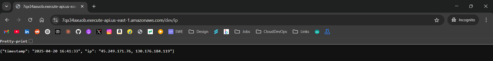

# 🌐 ServerIP - AWS Lambda Microservice

## 📋 Overview

**ServerIP** is a serverless microservice that displays the client's IP address and current timestamp. Built with Python Flask, containerized with Docker, and deployed on AWS Lambda using Terraform for infrastructure provisioning.



## 🧰 Technology Stack

| Component | Technology/Tools |
|-----------|------------------|
| Backend | Python 3.8, Flask |
| Containerization | Docker |
| Cloud Provider | AWS |
| Services | Lambda, API Gateway, ECR |
| Infrastructure as Code | Terraform |
| Environment | Serverless |

## 🏗️ Architecture

```
Client Request
     ↓
API Gateway
     ↓
AWS Lambda (Containerized Flask App)
     ↓
Response (IP Address & Timestamp)
```

## 📁 Project Structure

```
serverip/
├── app/                       # Application code
│   ├── app.py                 # Flask application & Lambda handler
│   ├── Dockerfile             # Container configuration
│   └── requirements.txt       # Python dependencies
├── terraform/                 # Infrastructure as code
│   ├── main.tf                # Main Terraform configuration
│   ├── variables.tf           # Variable definitions
│   ├── outputs.tf             # Output definitions
│   └── backend.tf             # S3 backend configuration
└── screenshots/               # Application screenshots
    └── serverip-app.png       # UI screenshot
```

## 🚀 Deployment Guide

### Prerequisites

- AWS CLI installed and configured
- Docker installed
- Terraform installed (v1.5.x or later)
- S3 bucket for Terraform state (optional)

### Step 1: Application Deployment

Navigate to the application directory and build the Docker image:

```bash
cd app

# Build Docker image
docker build --provenance=false -t serverip:v1 .

# Tag image for ECR
docker tag serverip:v1 <aws-id>.dkr.ecr.<region>.amazonaws.com/serverip:v1

# Login to ECR
aws ecr get-login-password --region <region> | docker login --username AWS --password-stdin <aws-id>.dkr.ecr.<region>.amazonaws.com

# Push image to ECR
docker push <aws-id>.dkr.ecr.<region>.amazonaws.com/serverip:v1
```

### Step 2: Infrastructure Provisioning

Navigate to the Terraform directory and initialize:

```bash
cd ../terraform

# Configure AWS credentials (if not already done)
aws configure

# Initialize Terraform
terraform init

# Review the execution plan
terraform plan

# Apply the infrastructure
terraform apply
```

After successful deployment, the API Gateway URL will be displayed in the terminal.

## 🔍 Accessing the Application

1. Once deployment is complete, retrieve the API URL from Terraform outputs:
   ```bash
   terraform output
   ```

2. Open the URL in your web browser to see your IP address and the current timestamp.

## 📊 Monitoring and Logging

- Lambda logs are available in CloudWatch Logs
- Monitor Lambda function performance in the AWS Lambda console
- API Gateway metrics are available in the API Gateway console

## 🔧 Troubleshooting

| Issue | Resolution |
|-------|------------|
| Docker build failure | Ensure Docker daemon is running and you have proper permissions |
| ECR push failure | Verify AWS credentials and ECR repository existence |
| Lambda deployment failure | Check image compatibility with Lambda and IAM permissions |
| API Gateway errors | Verify Lambda function works correctly and API Gateway is properly configured |

## 🧪 Local Development

You can run the application locally for development:

```bash
# Navigate to app directory
cd app

# Install dependencies
pip install -r requirements.txt

# Run Flask app locally
python app.py
```

The application will be available at http://localhost:80

## 🛠️ CI/CD Integration (Optional)

This project can be easily integrated with CI/CD pipelines using GitHub Actions or Jenkins:

1. Automate Docker build and push to ECR
2. Run Terraform validation and deployment
3. Implement automated testing

## 📚 Additional Resources

- [AWS Lambda Documentation](https://docs.aws.amazon.com/lambda/)
- [Terraform AWS Provider](https://registry.terraform.io/providers/hashicorp/aws/latest/docs)
- [Flask Documentation](https://flask.palletsprojects.com/)
- [Docker Documentation](https://docs.docker.com/)

## 📝 License

This project is licensed under the MIT License - see the LICENSE file for details.

## 👤 Contact

For questions or contributions, please contact:

- **Developer**: Aswin Sagar
- **Email**: aswinsagar12@gmail.com
- **LinkedIn**: [linkedin.com/in/aswinsagar12](https://linkedin.com/in/aswinsagar12)